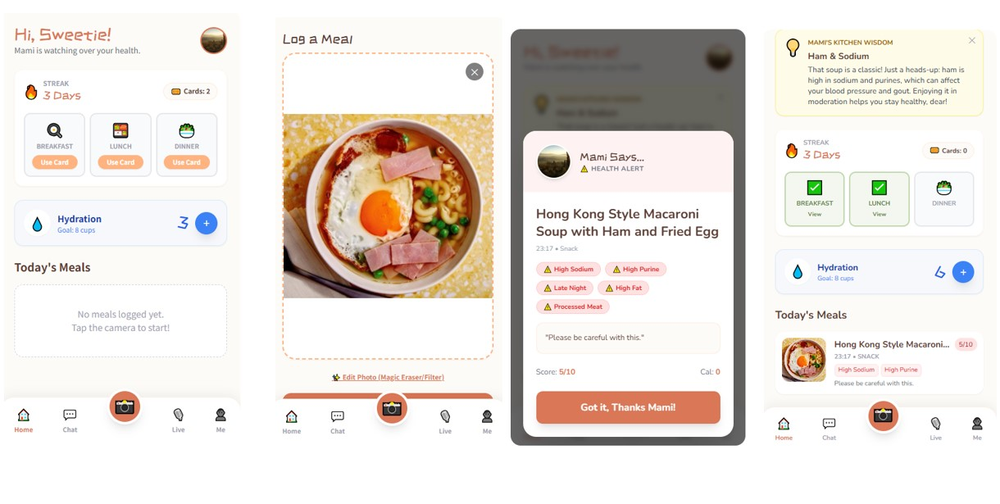
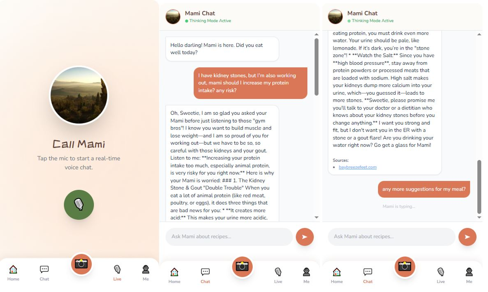
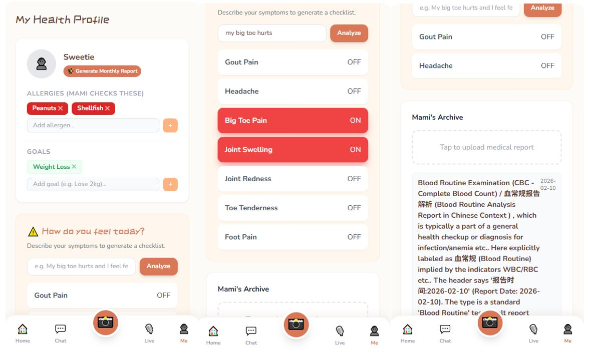

<div align="center">

### 🖼️ MamiHealth App Preview

<table>
  <tr>
    <td align="center">
      <br>
      <sub><b>Landing Page</b></sub>
    </td>
    <td align="center">
      <br>
      <sub><b>Chat Interaction</b></sub>
    </td>
    <td align="center">
      <br>
      <sub><b>Settings Page</b></sub>
    </td>
  </tr>
</table>

</div>


<!-- Project Banner -->
<div align="center">
  <a href="https://github.com/YourOrg/MamiHealth">
    
  </a>
</div>

<h2 align="center">
  Your AI Nutrition Companion — Make Better Food Choices, One Photo at a Time
</h2>

<div align="center">

[](https://mamihealth.app)  
[](./docs)  
[](https://github.com/YourOrg/MamiHealth/stargazers)  
[](https://github.com/YourOrg/MamiHealth/fork)  
[](./LICENSE)

</div>

<div align="center">

<h3 align="center">
<a href="./README.md">English</a> | <a href="./README-zh.md">简体中文</a>
</h3>

</div>

---

## 💡 What is MamiHealth?

**MamiHealth** is an AI-powered nutrition companion designed for people managing chronic diseases, weight loss goals, or unhealthy eating habits due to busy lifestyles.

It turns a simple daily habit — taking a photo before meals — into a powerful health decision-making moment, with personalized food suggestions based on user profiles, health data, and medical risks.

Unlike calorie-counting apps, MamiHealth offers warm, empathetic, and behavior-friendly AI support that meets users where they are.

---

## ✨ Key Features

- 📸 **Pre-meal photo recognition**  
  Automatically analyzes your food composition using AI image models.

- 🩺 **Health-aware dietary advice**  
  Tailored suggestions based on chronic conditions (diabetes, gout, hypertension, etc.)

- 💬 **“Mami AI” Companion**  
  A virtual, warm, supportive guide — not a cold data bot.

- 🧠 **Long-term health data archiving**  
  Tracks trends, behaviors, and generates quarterly health summaries.

- 🔁 **Gentle behavior nudging**  
  Encourages sustainable healthy habits through micro-interactions, not punishment.

---

## 🧭 System Workflow Overview

The following diagram illustrates how MamiHealth works behind the scenes:

```
+--------------------+
|  User takes photo  |
+--------------------+
          |
          v
+-------------------------+
|  AI analyzes the meal   |
|  (food type, nutrients) |
+-------------------------+
          |
          v
+-------------------------------+
|  Match with user health data |
| (e.g. diabetes, gout risks)  |
+-------------------------------+
          |
          v
+------------------------------+
|  Generate personalized tip  |
|  via Mami AI (e.g. “Too salty!”) |
+------------------------------+
          |
          v
+------------------------------+
|  Update trend archive       |
|  and habit tracking         |
+------------------------------+
```

---

## 🚀 Quick Start

You can view and remix the live AI app here:  
👉 [MamiHealth on AI Studio](https://ai.studio/apps/drive/1UZRccbhMGKNyrQHFgZiV7Xktafy9OPpU)

---

## ⚙️ Installation

```bash
git clone https://github.com/YourOrg/MamiHealth.git
cd MamiHealth
npm install
```

---

## 💻 Run Locally

```bash
# Set up API key
echo "GEMINI_API_KEY=your_api_key_here" > .env.local

# Start the dev server
npm run dev
```

Then open:

```
http://localhost:5173
```

---

## 🔐 Environment Variables

| Key             | Description                       |
|------------------|-----------------------------------|
| `GEMINI_API_KEY` | Required to use the AI backend     |

---

## 🎯 Target Users

- 👨‍⚕️ Patients managing chronic diseases (gout, diabetes, etc.)  
- 👩 Individuals on weight-loss journeys  
- 🏙 Busy professionals who rely on takeout meals  

---

## 🔬 B2B Use Cases

- Health screening + food behavior feedback for checkup centers  
- Corporate wellness & employee dietary nudging  
- Integration with insurance wellness scoring  
- Nutrition-sensitive food brand partnerships (recommendation engine)

---

## 🧪 Demo Video

🎥 _(Insert demo link here — YouTube, Bilibili, or WebM)_

---

## 📊 Roadmap

- [ ] iOS / Android native app  
- [ ] Personal dashboard + data visualization  
- [ ] Nutrition trend reporting engine  
- [ ] B2B partnership API  
- [ ] Personalized recipe recommendations  

---

## 🤝 Community

We’re building an open, collaborative health-tech community.  
Have ideas? Want to partner, contribute, or share feedback?

- [Discussions](https://github.com/YourOrg/MamiHealth/discussions)  
- [Submit an Issue](https://github.com/YourOrg/MamiHealth/issues)  
- [Request a Feature](https://github.com/YourOrg/MamiHealth/issues/new?labels=feature)

---

## 🙌 Contributing

We welcome contributions of all kinds!

```bash
# Fork the repo
# Clone and start coding
```

See [CONTRIBUTING.md](./CONTRIBUTING.md) for full guidelines.

---

## 📄 License

This project is licensed under the MIT License.  
See [`LICENSE`](./LICENSE) for details.

---

## ⭐ Star History

[](https://star-history.com/#YourOrg/MamiHealth)

---

_Made with 🧡 to help people eat better, live healthier, and feel cared for._
